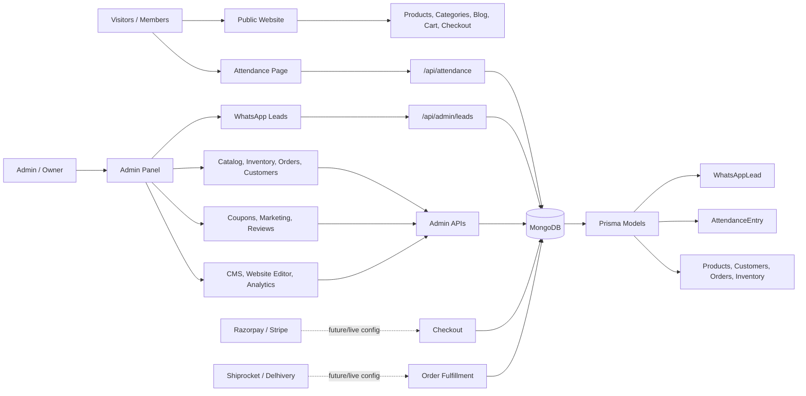

# The Complete Health App Overview

![[attachments/tch-app-overview.svg]]

## One-Page App Graph

## Short Explanation

- **Public Website**: Customers browse products, blog, cart, and checkout.
- **Attendance Page**: Members submit attendance by mobile number. It saves to MongoDB.
- **WhatsApp Leads**: Admin can save/search/export WhatsApp group contacts.
- **Admin Panel**: Owner controls catalog, inventory, orders, CRM, coupons, reviews, marketing, CMS, analytics, and security.
- **MongoDB + Prisma**: Main database layer for live data.
- **External Services**: Payments and shipping are ready to connect with provider credentials.

## Current Working Core

- Admin login
- Attendance page
- WhatsApp leads
- Admin dashboard and modules
- MongoDB connection
- Prisma schema

